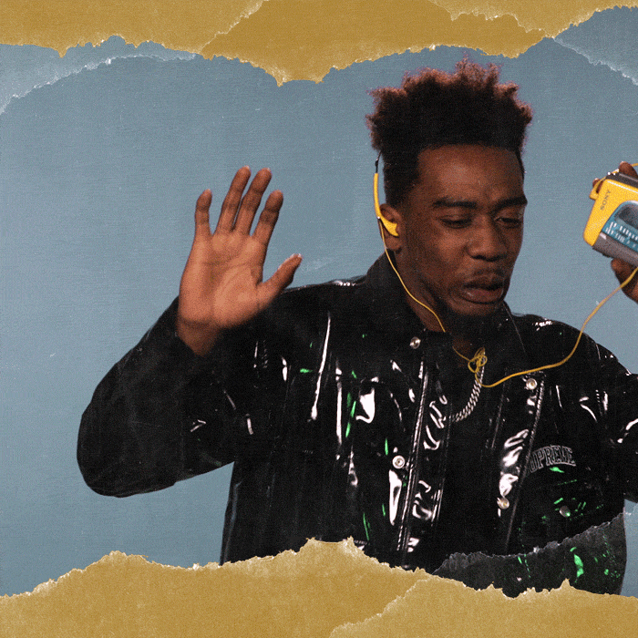

# Shake to Play Web App

## Overview

The "Shake to Play" web app is a simple web application that allows you to trigger a pre-recorded message by either shaking your device or clicking a button. It's a fun and interactive way to play a message, and it can be used for various purposes, including games and entertainment.

## Features

- Play a pre-recorded audio message by shaking your device or clicking a button.
- Adjustable sensitivity for shake detection.
- Mobile-friendly design.

## Getting Started

To get started with this web app, follow the steps below:

1. **Clone or Download the Repository**

   Clone or download this repository to your local machine.

2. **Set Up Your Pre-recorded Message**

   - Prepare your pre-recorded message as an audio file (e.g., an MP3 file).
   - Rename your audio file to `your-audio-file.mp3`.
   - Place the audio file in the project folder.

3. **Testing**

   - Open `index.html` in a web browser on your mobile device.
   - Shake your device to trigger the message, or click the "Shake or Click to Play" button.(Tap anywhere to activate the shake functionality)

4. **Customization**

   - You can adjust the sensitivity of the shake detection by modifying the `shakeThreshold` value in the `script.js` file.
   - Customize the HTML and CSS to change the appearance and layout of the app to suit your preferences.

## Code Structure

The project consists of three main files:

- `index.html`: The HTML file that defines the structure of the web app.
- `styles.css`: The CSS file for styling the web app.
- `script.js`: The JavaScript file for handling shake detection and message playback.

## Acknowledgments

- The project uses JavaScript for device motion detection.

## License

This project is open-source and available under the [MIT License](LICENSE).

## Contributing

If you'd like to contribute to this project or have any suggestions, feel free to submit issues or pull requests.

## Author

- [Capwell Murimi](https://github.com/capwell-murimi)

## Contact

For any questions or feedback, please contact [your.email@example.com](mailto:capwellmurimi@gmail.com).

Enjoy playing messages with "Shake to Play"!

---
